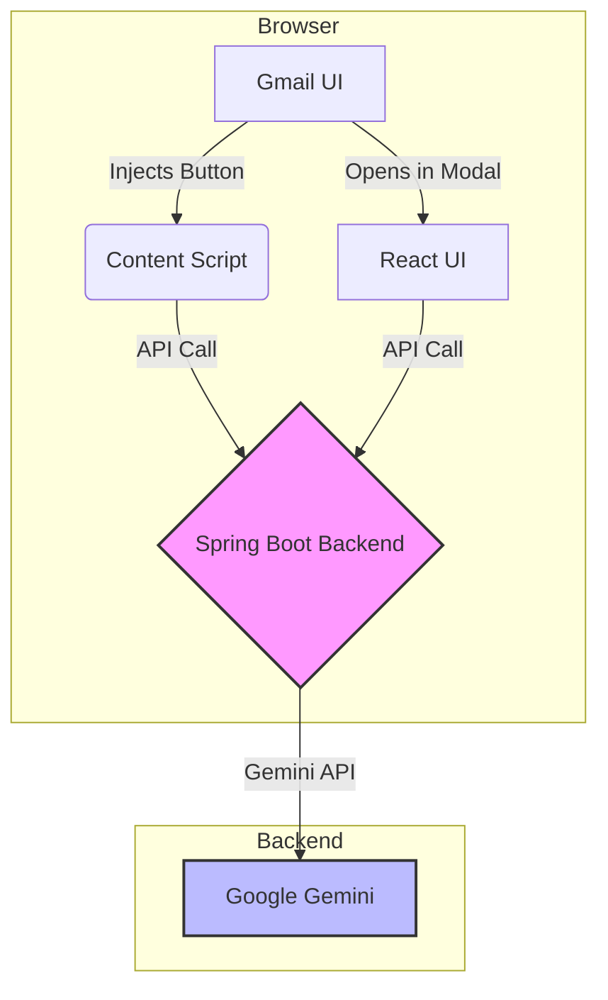

# Gmail AI Reply Generator

This project is an AI-powered email assistant that helps you write email replies quickly and efficiently. It integrates directly with Gmail, adding an "AI Reply" button to your compose window, and also provides a standalone web interface for generating emails.

This project is built with a modern, scalable architecture, making it a great showcase of full-stack development skills.

## Architecture Diagram



## Features

- **Seamless Gmail Integration:** Adds an "AI Reply" button directly into the Gmail interface.
- **Tone Adjustment:** Generate replies in different tones (Professional, Casual, etc.).
- **Standalone UI:** A clean, user-friendly web interface for generating emails outside of Gmail.
- **Secure and Scalable Backend:** Built with Spring Boot and secured with best practices.
- **Reactive and Modern:** Uses Spring WebFlux for a non-blocking, reactive backend.

## Tech Stack

- **Backend:** Java 17, Spring Boot, Spring WebFlux, Project Reactor
- **Frontend:** React 19, Vite, Material-UI, Axios
- **Browser Extension:** JavaScript, HTML, CSS (Manifest V3)
- **AI:** Google Gemini API
- **Testing:** JUnit 5, Mockito, WireMock

## Getting Started

### Prerequisites

- Java 17 or later
- Node.js 18 or later
- A Google Gemini API Key
- [dotenv-cli](https://www.npmjs.com/package/dotenv-cli) (for local development)

### Backend Setup (Local Development)

1.  **Navigate to the backend directory:**
    ```bash
    cd gmail-ai-reply-generator/email-writer-sb
    ```
2.  **Create a `.env` file** and add your Gemini API key:
    ```env
    GEMINI_URL=https://generativelanguage.googleapis.com/v1beta/models/gemini-1.5-flash:generateContent
    GEMINI_KEY=YOUR_ACTUAL_GEMINI_API_KEY
    ```
3.  **Start the backend using dotenv-cli:**
    ```bash
    dotenv -e .env -- ./mvnw spring-boot:run
    ```
    The backend will be running at `http://localhost:8080`.

### Frontend Setup (Local Development)

1.  **Navigate to the frontend directory:**
    ```bash
    cd gmail-ai-reply-generator/email-writer-react
    ```
2.  **Install dependencies:**
    ```bash
    npm install
    ```
3.  **Create a `.env.development` file** with the backend URL:
    ```env
    VITE_API_BASE_URL=http://localhost:8080
    ```
4.  **Run the application:**
    ```bash
    npm run dev
    ```
    The frontend will be running at `http://localhost:5173`.

### Browser Extension Setup

1.  **Open Chrome** and navigate to `chrome://extensions`.
2.  **Enable "Developer mode"** in the top right corner.
3.  **Click "Load unpacked"** and select the `gmail-ai-reply-generator/email-writer-ext` directory.
4.  The extension will be installed and ready to use in Gmail.

---

## Production Deployment (Demo)

### Backend (Spring Boot)

**Option 1: Docker (Recommended for Demo)**

1. Create a file named `.env.production` in `email-writer-sb` with your production Gemini API key:
    ```env
    GEMINI_URL=https://generativelanguage.googleapis.com/v1beta/models/gemini-1.5-flash:generateContent
    GEMINI_KEY=YOUR_PRODUCTION_GEMINI_API_KEY
    ```
2. Create a `Dockerfile` in `email-writer-sb`:
    ```dockerfile
    FROM eclipse-temurin:17-jre
    WORKDIR /app
    COPY target/email-writer-sb-0.0.1-SNAPSHOT.jar app.jar
    COPY .env.production .env
    RUN apt-get update && apt-get install -y curl && rm -rf /var/lib/apt/lists/*
    EXPOSE 8080
    CMD ["sh", "-c", "dotenv -e .env -- java -jar app.jar"]
    ```
3. Build and run the Docker image:
    ```bash
    ./mvnw clean package -DskipTests
    docker build -t gmail-ai-reply-backend .
    docker run -p 8080:8080 gmail-ai-reply-backend
    ```

**Option 2: Cloud Service (e.g., Render, Heroku, AWS, GCP)**
- Set `GEMINI_URL` and `GEMINI_KEY` as environment variables in your cloud provider's dashboard.
- Deploy the JAR or Docker image as per provider instructions.

### Frontend (React)

1. In `email-writer-react`, create a `.env.production` file:
    ```env
    VITE_API_BASE_URL=https://your-backend-domain.com
    ```
2. Build the frontend:
    ```bash
    npm run build
    ```
3. Serve the static files using a service like Vercel, Netlify, or your own web server.

### Browser Extension (Production)
- Build the React app so the latest UI is in `email-writer-ext/dist`.
- Zip the `email-writer-ext` directory and upload to the Chrome Web Store (or load as unpacked for demo).

---

## Future Improvements

- Unify the frontend by injecting the React app into the Gmail UI.
- Containerize the backend with Docker.
- Set up a CI/CD pipeline with GitHub Actions.
 
